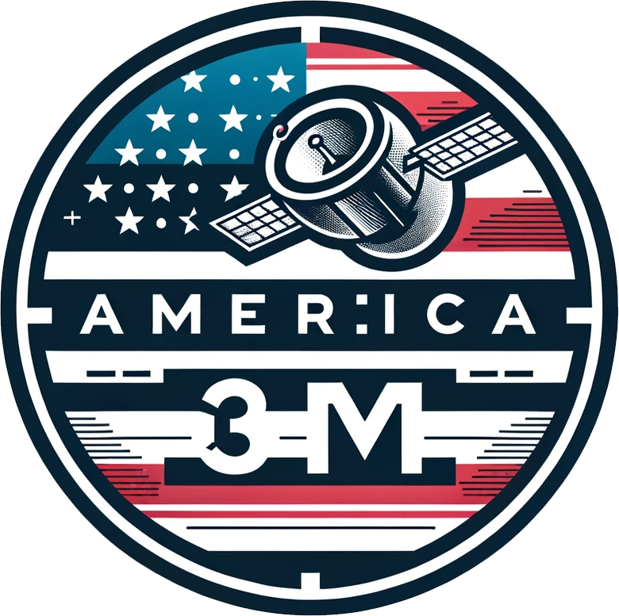
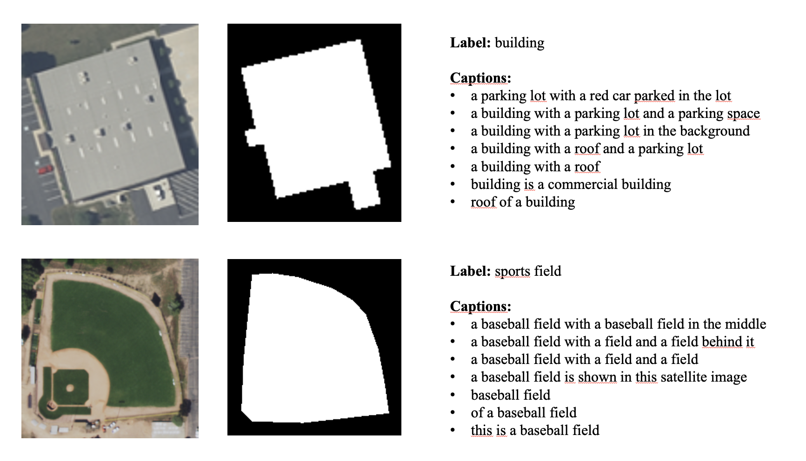
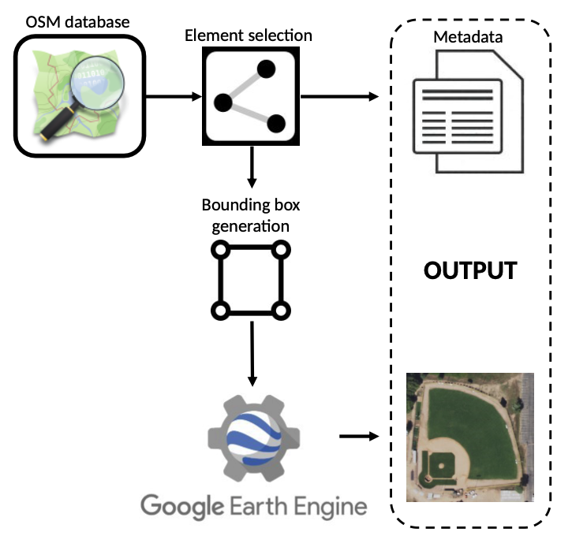
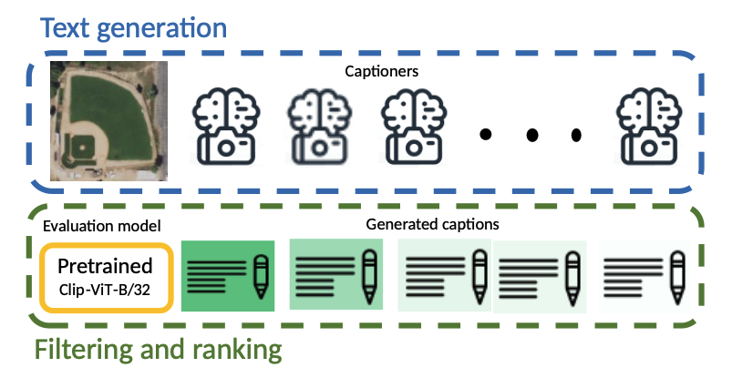
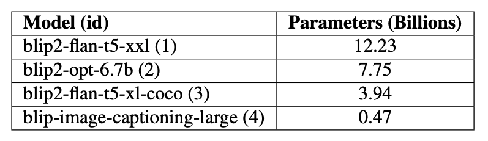
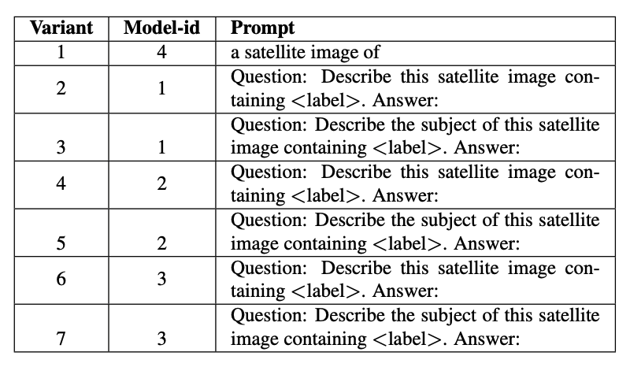
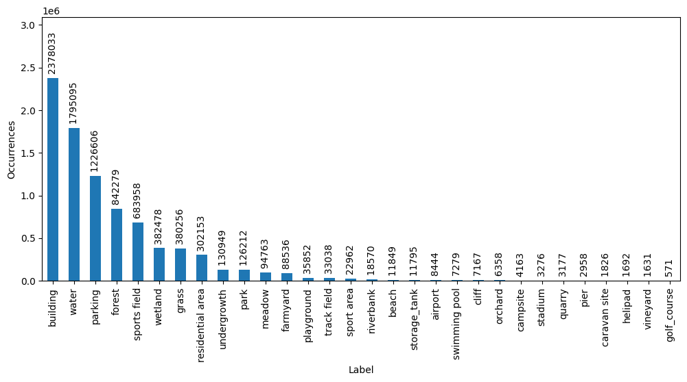

<center> 
<h1><strong>America3M</strong></h1>
<em>
Alberto Frizzera, info@albertofrizzera.com<br>
Riccardo Ricci, riccardo.ricci@unitn.it
</em>
<br>
</center>


<center> 

</center>

With this repository, we publish the America3M dataset which consists of 3 million satellite images from aerial imagery labeled with classes and synthetic captions.

More specifically, the dataset is composed of:
- 3M RGB images from the [NAIP program imagery](https://developers.google.com/earth-engine/datasets/catalog/USDA_NAIP_DOQQ)
- 30 class labels from OSM
- 7 synthetic captions per image
- binary masks of the main objects in the images



# Download
The dataset can be downloaded with Google Drive [here](https://drive.google.com/drive/folders/1rfY6lqjPy-CwXHkaCMD_H04zCvb-9lXv?usp=sharing). The entire dataset is 1TB large. However, you can download each American state separately and extract each archive with optmiized tools such as ```pigz``` in order to speed up the process.

# Data collection
We leverage the OpenStreetMap (OSM) database to collect metadata about locations of interest and Google Earth Engine (GEE) to collect images over the selected locations. In this study, we focused only on regions of interest (ROIs) in the United States, and used satellite imagery provided through
the NAIP program, spanning several American countries with a ground resolution of 0.6 meters/pixel. The complete data collection pipeline is represented in Figure 1. The process starts by interrogating OSM to retrieve all possible ROIs. For each ROI, information on the smallest envelope (bounding box) is used in Google Earth Engine to collect the satellite image. Metadata are saved to be used later during caption
generation. With this process, we collected a total of about 3 million satellite images spanning several American countries.



## Downloaded countries:
Alabama, Arizona, Arkansas, Colorado, Connecticut, Delaware, District of Columbia, Idaho, Illinois, Indiana, Iowa, Kansas, Kentucky, Louisiana, Maine, Maryland, Massachusetts, Michigan, Minnesota, Mississippi, Missouri, Montana, Nebraska, Nevada, New Hampshire, New Jersey, New Mexico, New York.

# Automatic caption generation
In the figures below the detailed caption generation pipeline is reported. We employed a collection of several variants of the BLIP architecture, varying both architecture and training data, in an attempt to increase descriptive text diversity. The first table below represents the list of captioning algorithms used in our work, along with their dimension in billions of parameters. To further increase the diversity of the outputs, we employed a list of different prompts, depicted in the second table attempting to extract different kinds of semantics from the satellite images. With each algorithm, a caption is created, yielding a total of 7 captions per image. Due to the generation strategy, it can happen that a certain caption is wrong or not related to the actual image contents. To evaluate relatedness, we employed
the original Clip-ViT-B/32 to evaluate the coherence of the generated text and the image, and use this metric to filter out unrelated pairs. Lastly, we filter out all the captions showing a score lower than 0.25. After this last post-processing step, the total number of images with at least one caption is around 1.2 million.







# Class labels




